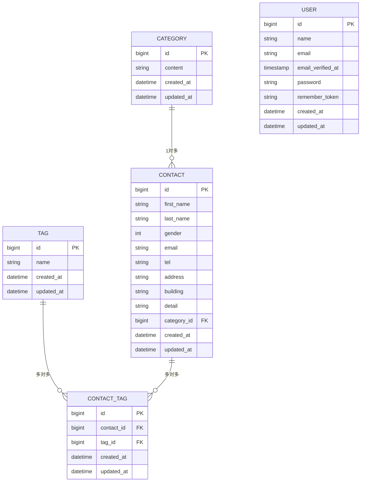

# COACHTECH お問い合わせフォーム

本プロジェクトは、COACHTECH カリキュラムに基づき作成した  
お問い合わせ管理システムです。  
問い合わせの登録・編集・削除・検索・タグ付け・CSV 出力・API 提供など、  
 CRUD + API 構成を備えています。

---

# 概要

本アプリケーションは、ユーザーからのお問い合わせ内容を管理するための  
問い合わせ管理システムです。

実装機能一覧

- お問い合わせの新規登録 / 編集 / 削除
- カテゴリ・タグによる分類
- タグの複数選択（多対多）
- 問い合わせ一覧の検索（キーワード・カテゴリ・日付）
- CSV エクスポート
- API（一覧 / 詳細 / 更新 / 削除）
- バリデーション（FormRequest）
- Seeder / Factory によるテストデータ生成

---

# ER 図（Mermaid）



# 環境構築手順（Docker / Laravel Sail）

以下の手順で、クローン後すぐに開発環境を構築できます。

---

## 1. リポジトリのクローン

git clone https://github.com/kayato109/contact-form-app  
cd contact-form-app

---

## 2. .env ファイルの作成

cp .env.example .env

.env 内の DB 設定が以下になっていることを確認してください。

DB_CONNECTION=mysql  
DB_HOST=mysql  
DB_PORT=3306  
DB_DATABASE=laravel  
DB_USERNAME=sail  
DB_PASSWORD=password

※ DB_HOST は localhost ではなく mysql（コンテナ名）を指定します。

---

## 3. Composer パッケージのインストール

```
docker run --rm \
 -u "$(id -u):$(id -g)" \
 -v "$(pwd):/var/www/html" \
 -w /var/www/html \
 laravelsail/php82-composer:latest \
 composer install
```

※ 注意  
以下の docker run コマンドは改行を含むため、行末の `\` も含めて正しくコピーしてください。  
もしうまく動かない場合は、1 行版を使用してください。

【1 行版】

```
docker run --rm -u "$(id -u):$(id -g)" -v "$(pwd):/var/www/html" -w /var/www/html laravelsail/php82-composer:latest composer install
```

---

## 4. Sail の起動

./vendor/bin/sail up -d

---

## 5. Node パッケージのインストール

sail npm install

---

## 6. Vite 開発サーバーの起動

sail npm run dev

※ sail npm run dev は実行したままにしておきます。

---

## 7. アプリケーションキーの生成

sail artisan key:generate

---

## 8. データベースのマイグレーション & 初期データ投入

sail artisan migrate --seed

※ データベースをリセットしたい場合  
sail artisan migrate:fresh --seed

---

## 9. 開発環境 URL

http://localhost

---

# 使用技術

PHP 8.2  
Laravel 10.x  
MySQL 8.4  
Docker（Laravel Sail）  
Nginx  
Blade / Vite  
Faker / Laravel Pint / PHPUnit

---

# API エンドポイント一覧

GET /api/v1/contacts … 問い合わせ一覧  
GET /api/v1/contacts/{id} … 問い合わせ詳細  
PUT /api/v1/contacts/{id} … 問い合わせ更新  
DELETE /api/v1/contacts/{id} … 問い合わせ削除

---

# 開発環境 URL

http://localhost

---

# 申し送り事項

1. first_name / last_name の扱いについて

- Blade 側の仕様に合わせ、first_name を「姓」、last_name を「名」として扱っています。
- これに合わせるため、ContactFactory では以下のように Faker の生成内容を調整しています。

```
  'first_name' => $faker->lastName(),
  'last_name' => match ($gender) {
      1 => $faker->firstNameMale(),
      2 => $faker->firstNameFemale(),
      default => $faker->firstName(),
  },
```

- テストコードも同様に first_name＝姓、last_name＝名 として統一しています。
- ※一般的なフォームとは入力順が逆になるため、ブラウザの予測入力が姓・名で逆になる可能性があります。

---

2. category_id の扱いについて

- contacts.category_id は NOT NULL 制約があるため、Factory では既存 Category からランダムに割り当てる方式にしています。
- これは Seeder 実行時に整合性を保つための対応です（テスト無しの環境では category_id を NULL にする実装も可能）。

---

3. 電話番号バリデーションの追加

- 要件には明記されていませんでしたが、ユーザー入力で起こり得るエラーを考慮し、StoreContactRequest に以下のエラーメッセージを追加しています。

```
  'tel.regex' => '電話番号は10桁または11桁の数字で入力してください',
```

---

4. Controller の責務について

- 本プロジェクトでは教材に Service 層の説明がなかったため、ロジックは Controller に集約しています。
- 特に CSV エクスポート処理などは本来 Service 層に切り出すべき箇所ですが、教材仕様に合わせて Controller 内で実装しています。

---

# 作成者

上木屋　陽斗
